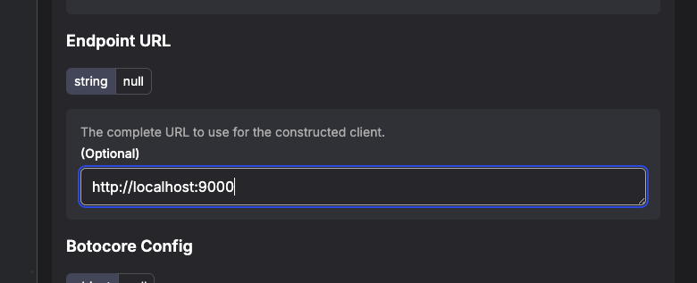

# Prefect Weather ETL Pipeline

This project is a **demonstration ETL pipeline** built with **Prefect 3**, using **PostgreSQL** as a database, **MinIO (S3-compatible)** as intermediate storage, and **caching** for API calls.  
The pipeline fetches weather data from a public API, stores raw data in S3, processes and transforms it into a structured DataFrame, and finally loads it into PostgreSQL.

---

## Features

- **Prefect 3 orchestration** for tasks and flow management
- **S3 (MinIO)** integration for intermediate data storage
- **SQLAlchemy** connection to PostgreSQL
- **Caching** of API calls to avoid redundant requests
- **Automated credentials seeding and deployment creation**
- **Dockerized** for local or remote execution

---

## Setup

### Requirements

- Docker + Docker Compose
- Python 3.12 + [uv](https://github.com/astral-sh/uv) (for local runs)

---

## Run with Docker

1.  Create a `.env` file (see example in repo).
2.  Start all containers and worker:

    ```bash
    make up
    ```

3.  Access:

    - Prefect UI → http://localhost:4200
    - MinIO Console → http://localhost:9001

## Local Development

1.  Seed Prefect blocks:

    ```sh
    uv run seed_credentials.py
    ```

2.  Deploy flow:

    ```sh
    uv run deploy.py
    ```

3.  Start worker

    ```sh
    prefect worker start --pool "basic-pipe"
    ```

4.  Create workpool

    ```sh
    prefect work-pool create 'basic-pipe' --type process
    ```

---

## Notes

- The MinIO bucket defined in `.env` is created automatically on startup.
- ‼️ Before the first run, open the Prefect UI → Blocks → “AWS Credentials”, edit it, and manually set the **endpoint_url** for MinIO.
  - `http://minio:9000` - only with docker ‼️
  - `http:localhost:9000` - for local
    
- Environment variables (API URL, credentials, DB, etc.) are managed via `.env` and loaded by `docker-compose`.
- The Prefect API URL inside Docker is:  
   `http://prefect-server:4200/api`

---

## Makefile Commands

| Command       | Description                             |
| ------------- | --------------------------------------- |
| `make up`     | Start all containers (Prefect + worker) |
| `make down`   | Stop and remove all containers          |
| `make seed`   | Seed Prefect credentials locally        |
| `make deploy` | Create Prefect deployment               |
| `make worker` | Run local Prefect worker                |
| `make pool`   | Create Prefect worker pool if missing   |

---

## URLs

- **Prefect UI:** http://localhost:4200
- **MinIO Console:** http://localhost:9001
- **MinIO API Endpoint (local):** http://localhost:9000
- **MinIO API Endpoint (docker):** http://minio:9000
